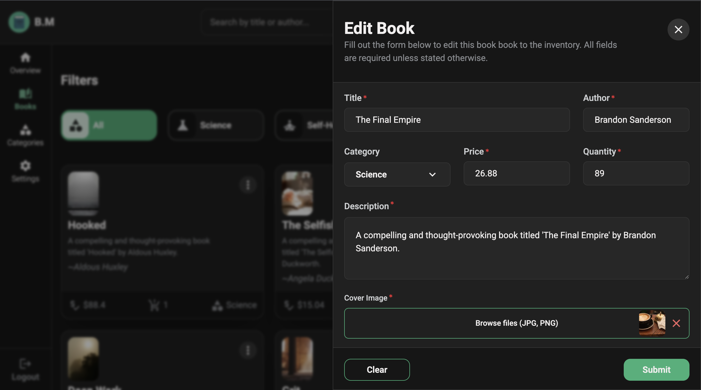

# 📚 BookManager

A full-stack book inventory management dashboard built with React, TypeScript, Tailwind CSS, and Supabase. BookManager allows authenticated users to create, manage, and edit a personalized catalog of books — all within a modern, responsive, and accessible UI.


## Features

- **User Authentication**  
  Secure login & registration via Supabase Auth with protected routes.

- **Book Management**  
  Full CRUD functionality with client-side validation and image preview support.

- **Theme & Personalization**  
  User preferences for light/dark/system theme, custom fonts, and language settings.

- **Internationalization (i18n)**  
  Language toggle between English and Finnish.

- **Responsive & Accessible Design**  
  Keyboard navigable, screen-reader friendly, and fully responsive across breakpoints.

- **Smooth Animations**  
  Framer Motion and transitions used for modals, interactions, and layout changes.

- **User-Based Data Ownership**  
  Supabase Row-Level Security (RLS) ensures users access only their own data.

- **Analytics Page (coming soon)**  
  Planned dashboard to visualize user reading stats and trends.


## 🛠️ Tech Stack

- **Frontend**: React, TypeScript, Vite, Tailwind CSS  
- **State Management**: React Context API, Custom Hooks  
- **Animations**: Framer Motion  
- **Auth & Database**: Supabase (Auth, Realtime DB, Storage, RLS)  
- **Routing**: React Router v6  
- **Forms**: Controlled inputs with validation and live previews  
- **Icons**: Material UI Icons & Custom SVG  
- **i18n**: Simple language state + support for EN & FI


## Screenshots


  
  



## Folder Structure (Simplified)
src/
├── components/         // Reusable UI elements (modals, inputs, icons, loaders)
├── features/           // Feature-specific logic (books, auth, settings)
├── context/            // Theme, Auth, Alert providers
├── hooks/              // Custom hooks (useBookFetch, useTheme, etc.)
├── pages/              // App routes and layout structure
├── utils/              // Constants, formatters, validation helpers
└── assets/             // SVGs, images, fonts


## Getting Started

```bash
# 1. Clone repo
git clone https://github.com/VictorKevz/book-manager.git

# 2. Install dependencies
cd bookmanager && npm install

# 3. Set up .env file
# Create .env.local and add:
VITE_SUPABASE_URL=your_url
VITE_SUPABASE_ANON_KEY=your_anon_key

# 4. Run locally
npm run dev